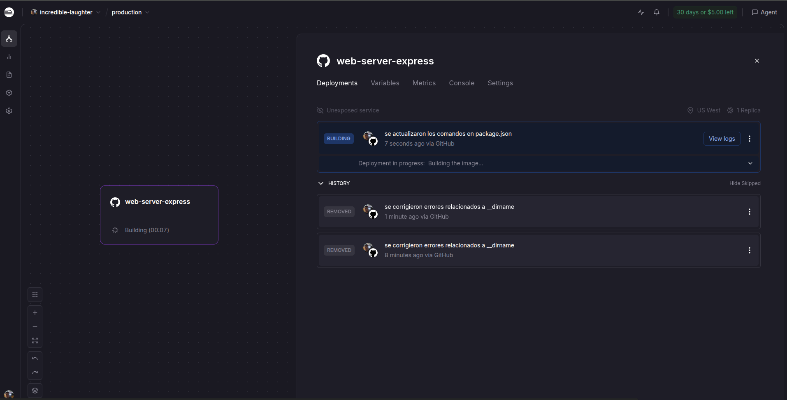
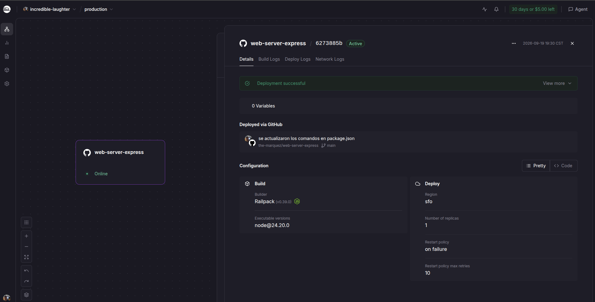
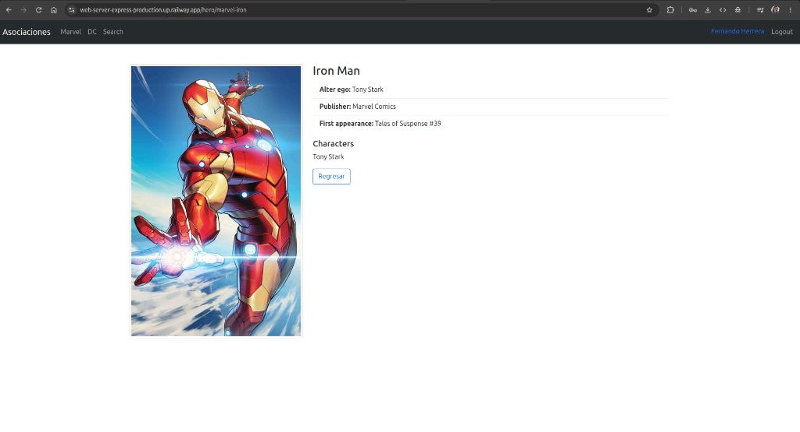

# 🚀 Web Server Express - SPA Host


Un servidor web de alto rendimiento construido con Node.js, Express y TypeScript. Diseñado específicamente para servir aplicaciones estáticas (Single Page Applications como React, Angular o Vue) manejando correctamente el enrutamiento del lado del cliente.

---

## 🏗️ Arquitectura y Resoluciones Técnicas

Durante el desarrollo de este proyecto, se implementaron soluciones modernas para adaptar el servidor a las últimas características de Node.js v24+ y Express 5.x:

* **TypeScript Nativo (Sin Transpilación):** Se eliminó el uso de compiladores tradicionales (`tsc`) en favor del flag nativo `--experimental-strip-types` de Node.js, agilizando el flujo de trabajo tanto en desarrollo como en producción.
* **Compatibilidad Total con ESM:** Transición exitosa a ES Modules, reemplazando el tradicional `__dirname` de CommonJS por `import.meta.dirname` para la resolución segura y nativa de rutas estáticas.
* **Enrutamiento SPA (Catch-All):** Resolución de conflictos de enrutamiento en la nueva versión de `path-to-regexp` (Express 5) mediante el uso de la expresión regular `/.*/` para redirigir cualquier ruta no mapeada por la API hacia `index.html`.

---

## ⚙️ Configuración del Proyecto (`package.json`)

Para lograr que la aplicación funcione en plataformas de la nube sin necesidad de compilar un directorio `dist` ni requerir un `tsconfig.json`, los `scripts` fueron optimizados de la siguiente manera:

```json
"scripts": {
  "dev": "node --watch --experimental-strip-types src/app.ts",
  "build": "echo 'No build step required'",
  "start": "node --experimental-strip-types src/app.ts"
}
```

> **Nota:** El script `build` se sobrescribe con un `echo` para evitar que la plataforma de despliegue intente ejecutar `tsc` por defecto y falle. El script `start` ejecuta el servidor directamente desde los archivos `.ts`.

---

## ☁️ Despliegue en Railway

Este proyecto está configurado para un despliegue continuo y sin fricciones utilizando [Railway](https://railway.app/). 

### Pasos para el despliegue:
1. Desde el panel de Railway, selecciona **New Project > Deploy from GitHub repo**.
2. Selecciona este repositorio.
3. Railway detectará automáticamente el archivo `package.json`, instalará las dependencias y ejecutará la aplicación usando el script `start`.

### 🔗 Generar un Dominio Público
Por defecto, los contenedores en Railway no están expuestos a internet. Para que tu aplicación sea accesible:
1. Ve al panel de tu proyecto en Railway y haz clic en la tarjeta de tu servicio web.
2. Navega a la pestaña **Settings** (Configuración).
3. Desplázate hasta la sección **Networking** (Redes).
4. Haz clic en el botón **Generate Domain**. 
5. Railway aprovisionará instantáneamente un certificado SSL y te asignará una URL pública (ej. `tu-proyecto.up.railway.app`) por la cual podrás acceder a tu aplicación.

---

## 📸 Evidencias de Producción

### Consola de Railway

*Historial de despliegue validando la corrección de rutas y el package.json.*


*Contenedor activo ejecutando Node.js v24.20.*

### Frontend React Servido Correctamente

*Index de la aplicación cargando assets desde el directorio público.*


*Demostración del Fallback de Express: Recarga de páginas en rutas dinámicas profundas (ej. perfil de Iron Man) funcionando sin devolver error 404.*

---

## 💻 Desarrollo Local

1. Clona el repositorio e instala las dependencias:
   ```bash
   npm install
   ```
2. Crea tu archivo `.env` en la raíz del proyecto:
   ```env
   PORT=3000
   PUBLIC_PATH=public
   ```
3. Coloca el *build* de tu aplicación frontend dentro de la carpeta definida en `PUBLIC_PATH`.
4. Inicia el servidor con recarga automática:
   ```bash
   npm run dev
   ```

---
**Autor:** [Elmer Leonel Márquez Argueta](https://github.com/the-marquez)